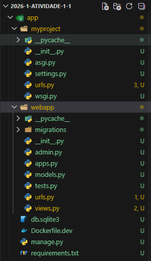
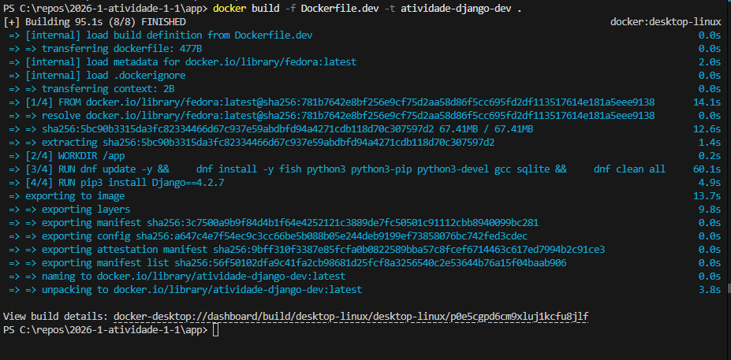
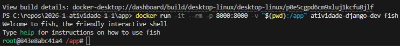
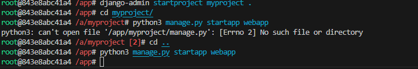
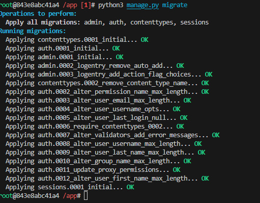
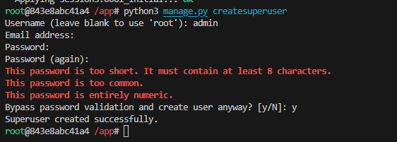
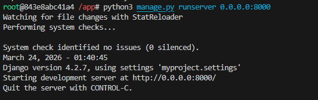
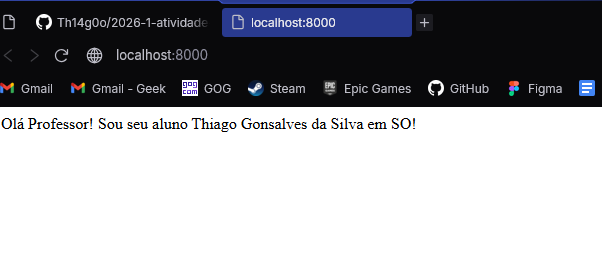
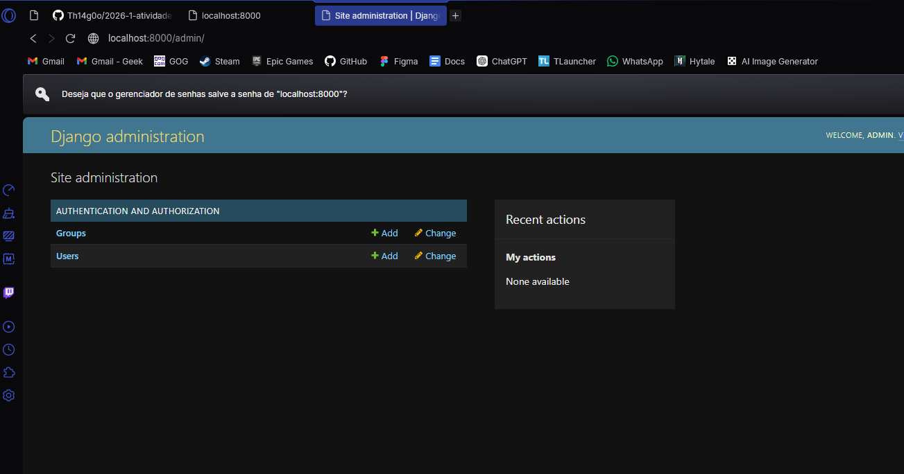
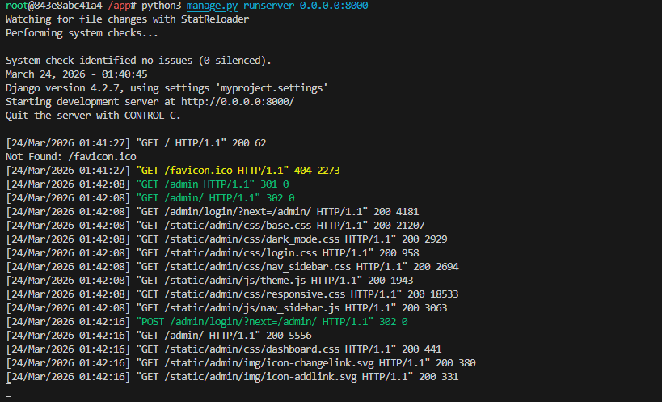

<h1>Relatório da Prova Docker-Django | Thiago Gonsalves da Silva </h1>

<h2>Introdução</h2>

Neste relatório, irei relatar minha experiência com a primeira atividade avaliativa de Sistemas Operacionais, cujo intuito é, utilizando Docker, subir um projeto Django, de modo que a pasta principal do container seja compartilhada com o hospedeiro e que o hospedeiro consiga acessar o projeto como cliente.

<h2>Relato</h2>

A atividade avaliativa já continha o passo a passo, então o que fiz foi apenas segui-lo. Não demorou muito, o tutorial era bem direto e, com os programas corretos instalados, não tive muitos problemas.

> A imagem abaixo possui a estrutura final de arquivos e pastas do projeto no Visual Studio Code



Comecei criando a pasta app e colocando 2 arquivos nela: ```requirements.txt``` e ```Dockerfile.dev```. Os conteúdos deles já constavam no passo a passo. Em seguida, executei a criação do container com base no ```Dockerfile.dev``` e o rodei já mapeando o diretório e a porta, como mostrado nas 2 imagens abaixo.





Dentro do container e seguindo o tutorial, o próximo passo foi iniciar o projeto Django chamado ```myproject``` e criar uma aplicação chamada ```webapp```. Após a criação, realizei as modificações no INSTALLED_APPS e ALLOWED_HOSTS conforme o tutorial.

> A imagem abaixo mostra os comandos executados no terminal



Em seguida, gerei a primeira migração do sistema para criar o banco de dados e depois criei um superusuário para acessar a tela de admin com os dados recomendados no próprio passo a passo.





Por fim, criei uma pequena view e configurei sua rota na pasta da aplicação ```webapp``` e incluí a rota no ```myproject```. Com a view criada, rodei o último comando para executar o projeto e acessei tanto a tela que criei quanto a interface de admin padrão do Django.

> A imagem abaixo mostra o comando de execução



> A imagem abaixo mostra a interface da view



> A imagem abaixo mostra a interface de administração



> A imagem abaixo mostra o terminal após o acesso como cliente



<h2>Considerações Finais</h2>

O tutorial foi realmente bem rápido. Acho que demorei mais montando o relatório do que fazendo o projeto em si. Acredito que a atividade serviu para absorver melhor o processo de iniciar um container Docker e mapear um diretório, bem como uma porta, que pode ser alterada no hospedeiro, o que facilitou bastante a modificação dos arquivos do projeto de maneira bem prática.